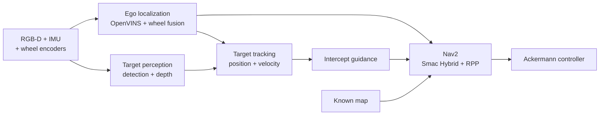
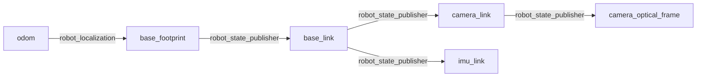

# Target Interception in GPS-Denied Simulation

## Objective

Build a simulated Ackermann car that can:

1. Localize without GPS using monocular RGB, IMU, and wheel odom
2. Detect and range a moving  target using aligned RGB-D data
3. Estimate the target's position and velocity in the local odom frame
4. Predict a reachable interception pose
5. Replan through a known static map with Ackermann-feasible paths
6. Follow those paths until the target is intercepted (or tracking becomes stale)

The default scenario is a 12 m square arena with a high-contrast floor grid,
distinct wall markers, four asymmetric obstacles, and a red 20 cm-radius ball
moving at 0.4 m/s around a deterministic three-meter circle. A matching known
occupancy map is loaded by Nav2.

## Architecture



### Layout

| Package | Responsibility |
| --- | --- |
| `robot_description` | Robot links, joints, geometry, and static sensor extrinsics |
| `robot_sim` | Gazebo world, RGB-D/IMU sensors, bridges, ros2_control, and unified bringup |
| `robot_interfaces` | Shared stamped target bounding-box message |
| `robot_vio` | OpenVINS pose adaptation and wheel/VIO fusion |
| `robot_perception` | Red-target detection and synchronized RGB-D projection |
| `robot_tracking` | Metric constant-velocity target Kalman filter |
| `robot_navigation` | Intercept guidance, Nav2 goal preemption, Smac Hybrid, and Regulated Pure Pursuit |

### TF Tree



## Bringup

### Prerequisites

Clone this repository in a ROS workspace, then install dependencies and build:

```bash
cd ~/target-intercept
rosdep install --from-paths src --ignore-src -r -y
colcon build --symlink-install
source install/setup.bash
```

Start OpenVINS with:

```text
inputs:  /camera/image_raw, /imu/data
output:  /ov_msckf/odomimu
```

Launch the full stack:

```bash
ros2 launch robot_sim intercept.launch.py
```

Override the world:

```bash
ros2 launch robot_sim intercept.launch.py \
  world:=/absolute/path/to/world.sdf \
  map:=/absolute/path/to/map.yaml
```

## Assumptions

#### Perception

- RGB and depth images are spatially aligned and use identical intrinsics
- There is only one (red) target and no data association problem
- The default red ball follows a deterministic circle and is not inserted into
  the Nav2 costmap

#### Estimation

- Wheel odometry contributes forward velocity and yaw rate only
- Target motion is approximately constant velocity between observations

#### Control

- The known map is aligned with the vehicle's startup odometry origin
- The default arena map has 0.1 m resolution and origin `[-6.5, -6.5, 0]`
- Runs are short enough that VIO drift does not misalign `odom` and the known map
- The target is not an obstacle inside the costmap
- Nav2 Smac uses `DUBIN` motion with a 0.54 m minimum turning radius
- Guidance and Regulated Pure Pursuit both assume a nominal maximum speed of
  1.0 m/s

## Checkpoints

| Checkpoint | Result |
| --- | --- |
| `ros2 topic hz /camera/image_raw` | RGB near 30 Hz |
| `ros2 topic hz /camera/depth_image` | Aligned depth near 30 Hz |
| `ros2 topic hz /imu/data` | IMU near 100 Hz |
| `ros2 topic echo --once /ov_msckf/odomimu` | OpenVINS odometry is available |
| `ros2 topic echo --once /odometry/filtered` | Fused odometry is available |
| `ros2 run tf2_ros tf2_echo odom base_footprint` | One continuous transform chain |
| `ros2 topic echo --once /perception/target_position` | Metric target measurement in `odom` |
| `ros2 topic echo --once /tracking/target_state` | Filtered target position and velocity |
| `ros2 topic echo --once /target/ground_truth/odom` | Ball ground truth for estimator evaluation |
| `ros2 topic echo --once /navigation/intercept_pose` | Fresh reachable intercept pose |
| `ros2 action list` | `/navigate_to_pose` is available |
| `ros2 topic echo --once /cmd_vel` | Nav2 produces a command while navigating |

## Roadmap

| Milestone | Deliverable | Status |
| --- | --- | --- |
| 0. Architecture | Coherent topics, frames, RGB-D projection, filtering, guidance, Nav2, and actuation wiring | Implemented; runtime verification pending |
| 1. Simulation scenario | Feature-rich world, moving red target, matching occupancy map, and target ground truth | Implemented; runtime verification pending |
| 2. Ego localization | Repository-owned OpenVINS config with bounded pose error against ground truth | Not started |
| 3. Target estimation | Validated RGB-D position and velocity error across representative ranges and motions | Not started |
| 4. Static navigation | Smac/RPP reaches stationary poses without collisions or TF/controller conflicts | Not started |
| 5. Moving interception | Repeatedly intercept a moving target in open space, then around static obstacles | Not started |
| 6. Resilience | Explicit loss/recovery state machine, safe stops, VIO reset handling, and timeout tests | Not started |
| 7. Global consistency | Map correction and live-obstacle support if longer or more realistic runs require them | Deferred |
