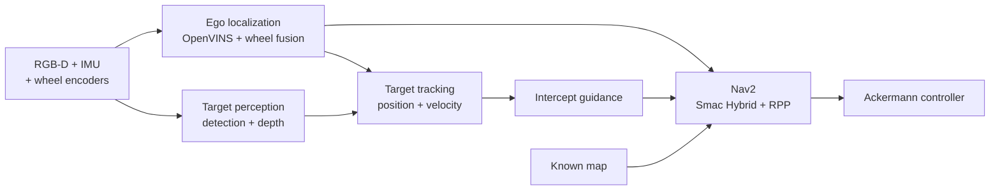
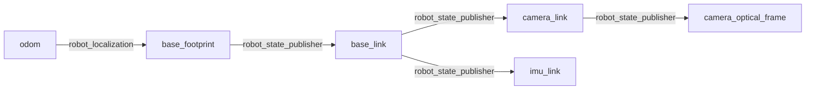

# Target Interception in GPS-Denied Simulation

> [!IMPORTANT]
> The architecture and core glue logic are implemented, but the complete system
> has not yet been built or exercised end to end in ROS 2 Jazzy. The default
> empty world, blank map, and missing target model cannot demonstrate the
> objective, and OpenVINS still requires external configuration.

## Objective

Build a simulated Ackermann-steered car that can:

1. Localize without GPS using monocular RGB, IMU, and wheel encoders.
2. Detect and range one moving visual target using aligned RGB-D data.
3. Estimate the target's metric position and velocity in the local odometry frame.
4. Predict a reachable interception pose.
5. Replan through a known static map with Ackermann-feasible paths.
6. Follow those paths until the target is intercepted or tracking becomes stale.

The intended proof of concept is a bounded, known, textured Gazebo environment
with one red target. Depth is used only for target ranging; OpenVINS remains
monocular RGB-inertial odometry.

## Architecture



The localization estimate provides both the planning pose and the timestamped
camera transform used to place target measurements in `odom`. Target tracking
then predicts an intercept pose; Nav2 plans and follows a feasible path to the
latest rate-limited prediction.

### Package responsibilities

| Package | Responsibility |
| --- | --- |
| `robot_description` | Robot links, joints, geometry, and static sensor extrinsics |
| `robot_sim` | Gazebo world, RGB-D/IMU sensors, bridges, ros2_control, and unified bringup |
| `robot_interfaces` | Shared stamped target bounding-box message |
| `robot_vio` | OpenVINS pose adaptation and wheel/VIO fusion |
| `robot_perception` | Red-target detection and synchronized RGB-D projection |
| `robot_tracking` | Metric constant-velocity target Kalman filter |
| `robot_navigation` | Intercept guidance, Nav2 goal preemption, Smac Hybrid, and Regulated Pure Pursuit |

### Frames and ownership



| Transform or frame | Owner | Rule |
| --- | --- | --- |
| `odom -> base_footprint` | `robot_localization` | Sole publisher |
| Robot and sensor extrinsics | `robot_state_publisher` | Generated from URDF |
| OpenVINS world frame | `vio_adapter` | Anchored to `odom` at the first accepted VIO pose |
| Known occupancy map | Nav2 map server | Published directly in `odom` |
| `map -> odom` | Nobody | Intentionally absent until global localization is added |

The simulator's Ackermann controller publishes `/odom` but has odometry TF
disabled, preventing a competing `odom -> base_footprint` transform.

## Current assumptions

### Sensors and perception

- ROS 2 Jazzy and its Nav2 parameter/API conventions are the target.
- RGB and depth images are spatially aligned, use identical intrinsics, and
  arrive within 50 ms.
- The largest red contour is the target; there is only one target and no data
  association problem.
- Median valid depth from the central half of the bounding box represents the
  target surface well enough for the proof of concept.
- Depth ranges from 0.1 m to 20 m and is not currently used as a costmap
  obstacle source.

### Estimation

- OpenVINS consumes `/camera/image_raw` and `/imu/data`, publishes
  `/ov_msckf/odomimu`, and does not publish the active robot TF.
- Wheel odometry contributes forward velocity and yaw rate only.
- VIO contributes planar position and yaw only; the raw IMU is not fused again
  downstream.
- Target motion is approximately constant velocity between observations.
- Target and ego state are represented in `odom`.

### Planning and control

- The known map is aligned with the vehicle's startup odometry origin.
- Runs are short enough that VIO drift does not materially misalign `odom` and
  the known map.
- The target is not inserted into the costmap as an obstacle.
- The car drives forward only. Smac uses `DUBIN` motion with a 0.54 m minimum
  turning radius.
- Guidance and Regulated Pure Pursuit both assume a nominal maximum speed of
  1.0 m/s.
- A target state or ego odometry older than 0.5 s stops intercept updates. The
  Nav2 goal manager cancels an intercept goal after 0.75 s without a fresh pose.
- Nav2 goals are sent at most every 0.5 s and only after the predicted intercept
  has moved at least 0.25 m.

## Unresolved decisions and design work

| Priority | Topic | Current state | Decision or work required |
| --- | --- | --- | --- |
| P0 | OpenVINS integration | External and unconfigured | Add Jazzy-compatible launch, camera/IMU calibration, noise densities, time offset, initialization, covariance, and reset handling |
| P0 | Demonstration world | Empty and visually featureless | Add textured ground, static landmarks, obstacles, lighting, and a moving red target |
| P0 | Known map | Blank placeholder | Create a map matching the demonstration world and verify its origin |
| P0 | Runtime integration | Not exercised end to end | Build, launch, inspect TF/topics/actions, and tune in a ROS 2 Jazzy environment |
| P1 | Target truth and evaluation | Ego truth only | Publish target ground truth and define position, velocity, intercept-time, collision, and success metrics |
| P1 | Mission state machine | Implicit timeout behavior only | Define initializing, searching, tracking, navigating, target-lost, localization-lost, intercepted, and stopped states |
| P1 | Interception feasibility | Point-mass constant-speed estimate | Incorporate Ackermann path length, acceleration, and planning latency into time-to-intercept |
| P1 | Target/costmap semantics | Target excluded from costmaps | Define capture radius and filtering if depth is later used for live obstacles |
| P1 | Covariance | Initial heuristic values | Tune VIO, depth-projection, and target-process covariance from simulation error |
| P1 | VIO reset behavior | First pose is anchored once | Detect relocalization/reset discontinuities and reset dependent target/navigation state |
| P2 | Long-run global consistency | Map fixed directly in `odom` | Add map-based localization or another source for `map -> odom` corrections |
| P2 | Detection model | One largest red contour | Decide whether to add confidence calibration, segmentation, and multi-target association |
| P2 | Dynamic obstacles | Static map only | Add an obstacle layer after filtering the tracked target from depth observations |

## Bringup

### Prerequisites

- ROS 2 Jazzy
- Gazebo Sim and `ros_gz`
- `ros2_control` with `ackermann_steering_controller`
- Nav2 with Smac Planner and Regulated Pure Pursuit
- OpenVINS configured for this camera and IMU
- `colcon` and `rosdep`

Place this repository in a ROS workspace, then install dependencies and build:

```bash
cd ~/robot_ws
rosdep install --from-paths src --ignore-src -r -y
colcon build --symlink-install
source install/setup.bash
```

Start OpenVINS with:

```text
inputs:  /camera/image_raw, /imu/data
output:  /ov_msckf/odomimu
```

Then launch the complete repository-owned stack:

```bash
ros2 launch robot_sim intercept.launch.py
```

Override the world or known map when they are available:

```bash
ros2 launch robot_sim intercept.launch.py \
  world:=/absolute/path/to/world.sdf \
  map:=/absolute/path/to/map.yaml
```

### Bringup checkpoints

| Checkpoint | Expected result |
| --- | --- |
| `ros2 topic hz /camera/image_raw` | RGB near 30 Hz |
| `ros2 topic hz /camera/depth_image` | Aligned depth near 30 Hz |
| `ros2 topic hz /imu/data` | IMU near 100 Hz |
| `ros2 topic echo --once /ov_msckf/odomimu` | OpenVINS odometry is available |
| `ros2 topic echo --once /odometry/filtered` | Fused odometry is available |
| `ros2 run tf2_ros tf2_echo odom base_footprint` | One continuous transform chain |
| `ros2 topic echo --once /perception/target_position` | Metric target measurement in `odom` |
| `ros2 topic echo --once /tracking/target_state` | Filtered target position and velocity |
| `ros2 topic echo --once /navigation/intercept_pose` | Fresh reachable intercept pose |
| `ros2 action list` | `/navigate_to_pose` is available |
| `ros2 topic echo --once /cmd_vel` | Nav2 produces a command while navigating |

## Roadmap

| Milestone | Deliverable | Status |
| --- | --- | --- |
| 0. Architecture | Coherent topics, frames, RGB-D projection, filtering, guidance, Nav2, and actuation wiring | Implemented; runtime verification pending |
| 1. Simulation scenario | Textured world, moving red target, matching occupancy map, and target ground truth | Not started |
| 2. Ego localization | Repository-owned OpenVINS config with bounded pose error against ground truth | Not started |
| 3. Target estimation | Validated RGB-D position and velocity error across representative ranges and motions | Not started |
| 4. Static navigation | Smac/RPP reaches stationary poses without collisions or TF/controller conflicts | Not started |
| 5. Moving interception | Repeatedly intercept a moving target in open space, then around static obstacles | Not started |
| 6. Resilience | Explicit loss/recovery state machine, safe stops, VIO reset handling, and timeout tests | Not started |
| 7. Global consistency | Map correction and live-obstacle support if longer or more realistic runs require them | Deferred |
