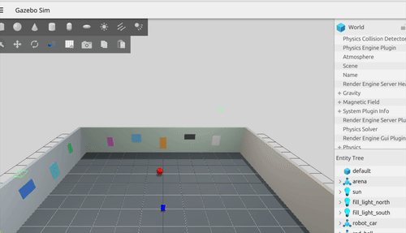

# Target Interception Simulation

ROS 2 simulation sandbox for moving object tracking and interception using an Ackermann-steered vehicle.  We begin by using ground truth for ego pose so that target projection, filtering, intercept prediction, and terminal guidance can be validated without a localization or navigation stack in the loop.



## Architecture

The v0 path uses four application nodes:

```text
/camera/image_raw
  -> color_detection
  -> target_projector <- /camera/depth_image + /ground_truth/odom
  -> target_ekf
  -> intercept_controller <- /ground_truth/odom
  -> /cmd_vel
```

| Package | Responsibility |
| --- | --- |
| `robot_description` | Ackermann vehicle geometry and static sensor extrinsics |
| `robot_sim` | Gazebo arena, sensors, bridges, control, and trial evaluation |
| `robot_interfaces` | Stamped 2D target-detection message |
| `robot_perception` | HSV detection and synchronized RGB-D projection |
| `robot_tracking` | Constant-velocity target Kalman filter |
| `robot_navigation` | Intercept solve and direct Ackermann pursuit control |
| `robot_odometry` | RTAB-Map RGB-D ego odometry and initial map alignment |

### v1 data flow

v1 keeps `/ground_truth/odom` for ego pose and adds two fixed chicane barriers,
a matching static Nav2 map, and explicit command ownership:

```text
/camera/* -> color_detection -> target_projector -> target_ekf
                                                    |
/ground_truth/odom -> ground_truth_tf -> Nav2 <-----+ (mid-course goal)
                                         |
                              /cmd_vel/nav2
/tracking/target_state -> direct terminal controller -> /cmd_vel/terminal
                                                     |
/navigation/cmd_vel_owner (STOP=0, NAV2=1, TERMINAL=2)
                  -> command_arbiter -> /cmd_vel
```

The supervisor sends estimated intercept goals to Nav2 outside the terminal
radius and gives the direct controller ownership inside it. Application nodes
consume camera-derived target state only; `/target/ground_truth/odom` is
reserved for trial evaluation. The fixed obstacles are known to the static map.
No dynamic obstacle sensing is configured, and trials start with the target in
the forward camera's view.

### v2 data flow

v2 replaces application use of ego truth with RGB-D odometry:

```text
/camera/image_raw + /camera/depth_image + /camera/camera_info
                         -> rgbd_odometry -> /localization/odom
                                             + odom -> base_footprint
known initial pose --------------------------> map -> odom
```

`/localization/odom` feeds target projection, Nav2, the interception supervisor,
and terminal control. The launch-time `map -> odom` transform seeds the known
initial robot pose; it is not runtime localization truth. `/ground_truth/odom`
and `/target/ground_truth/odom` remain subscribed only by the trial evaluator.

## Scenario

The vehicle starts in an empty 12x12m arena. A red ball moves at
0.4m/s on a 3m circle. The RGB-D pipeline estimates the target in `odom`, and
the controller repeatedly solves:

```text
|p_target - p_robot + v_target t| = v_robot t
```

before steering toward the resulting intercept point. The constant-velocity
filter is intentionally model-mismatched with circular motion; its lag is a
measured limitation rather than hidden by using target truth.

### Control Limits

The vehicle is forward-only and assumes the target is initially visible. Steering 
is limited by the 0.24m wheelbase and 0.6rad steering limit; linear acceleration and
deceleration are also bounded.

## Build and Run

In ROS 2 Jazzy:

```bash
rosdep install --from-paths src --ignore-src -r -y
colcon build --symlink-install
source install/setup.bash
ros2 launch robot_sim intercept.launch.py
```

The original command above and `intercept_arena.sdf` remain the v0 path. Run
the implemented v1 or v2 stack separately:

```bash
ros2 launch robot_sim v1_intercept.launch.py
ros2 launch robot_sim v2_intercept.launch.py
```

The default target starts at `(3, 0)` with the vehicle facing it. Robot and
target initial conditions are launch arguments:

```bash
ros2 launch robot_sim intercept.launch.py \
  robot_x:=0.5 robot_y:=-0.25 robot_yaw:=0.1 \
  target_x:=3.0 target_y:=0.0 target_yaw:=1.5708
```

### Random Trials

To run ten seeded trials:

```bash
ros2 run robot_sim run_trials.py \
  --trials 10 \
  --required-successes 8 \
  --output-dir trial_results
```

Each trial randomizes the target phase and the vehicle pose while initially
aiming the forward camera toward the target. `trial_results/summary.json`
contains each seed, minimum center distance, capture time, target-estimation
RMSE, and termination reason.

### v1 trial gate

```bash
ros2 run robot_sim run_v1_trials.py \
  --trials 10 \
  --required-successes 8 \
  --output-dir v1_trial_results
```

The proposed completion gate is at least 8 captures across the 10 deterministic
scenarios, zero fixed-obstacle contacts, complete collision samples for every
trial, and bounded per-trial/process timeouts. The runner writes per-trial logs
and JSON plus `summary.json`, including initial conditions, termination reason,
capture and contact counts, clearances, owner transitions, and estimation
errors. The implementation and static contracts are validated in this
repository; no ROS/Gazebo gate result is recorded here.

### v2 trial gate

```bash
ros2 run robot_sim run_v2_trials.py \
  --trials 10 \
  --required-successes 8 \
  --output-dir v2_trial_results
```

The v2 runner reuses the deterministic v1 scenarios and additionally requires
position RMSE at most 0.20 m, yaw RMSE at most 0.15 rad, final position error at
most 0.30 m, and localization availability of at least 95% in every trial.
Availability measures how often truth evaluation timestamps have a sufficiently
fresh odometry sample; truth is evaluator-only. Each trial runs in a fresh
process, and timestamp regressions or missing localization data fail the gate.
ROS/Gazebo results must still be collected on a Jazzy system with RTAB-Map.

## Roadmap

| Version | Increment |
| --- | --- |
| v0 | Open-space interception using ego ground truth |
| v1 | Obstacles and Nav2 for mid-course routing, with direct terminal pursuit |
| v2 | RGB-D ego odometry with known initial map alignment |
| v3 | Search, loss recovery, reset handling, and explicit mission states |  


#### Success criteria for v0:

| Criteria | Value |
| --- | --- |
| Capture radius | 0.45 m center-to-center |
| Capture dwell | 0.2 s |
| Trial timeout | 20 s |
| Required successes | 8 of 10 |
| Stale ego input | Zero command after 0.2 s |
| Stale target input | Zero command after 1.0 s of bounded extrapolation |